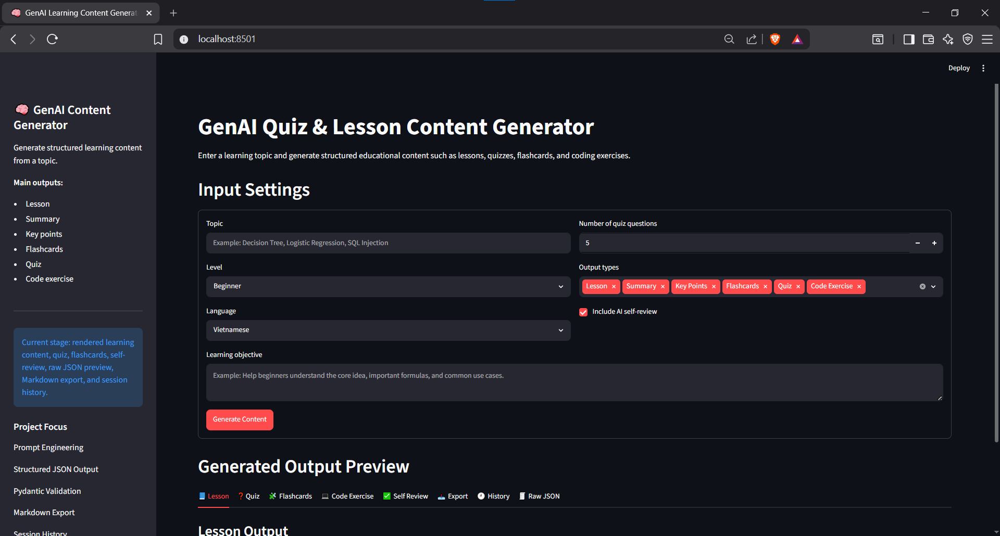
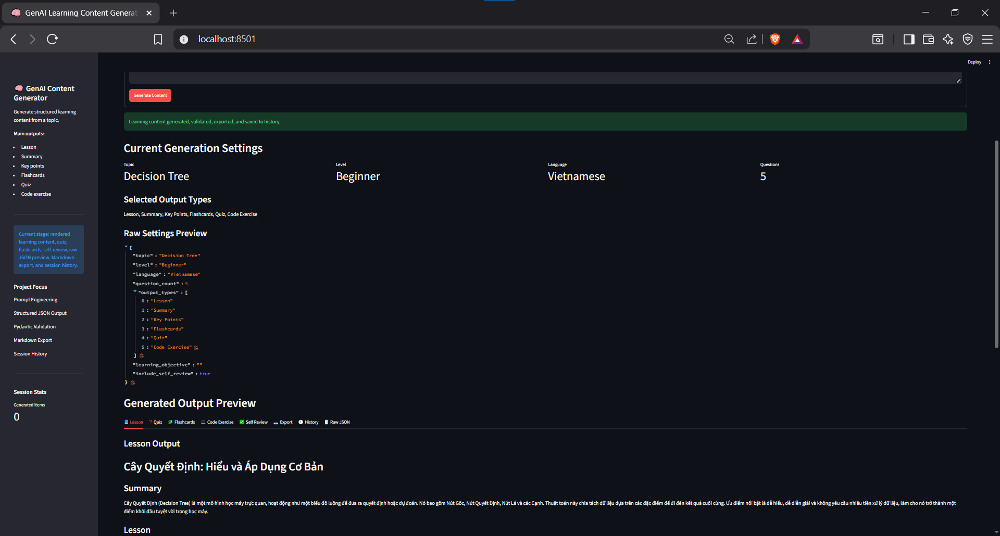
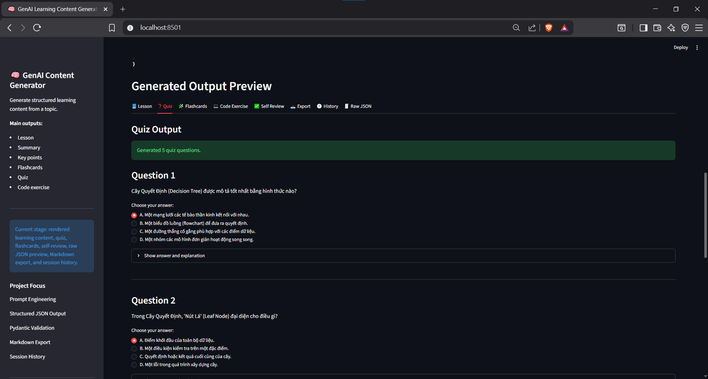
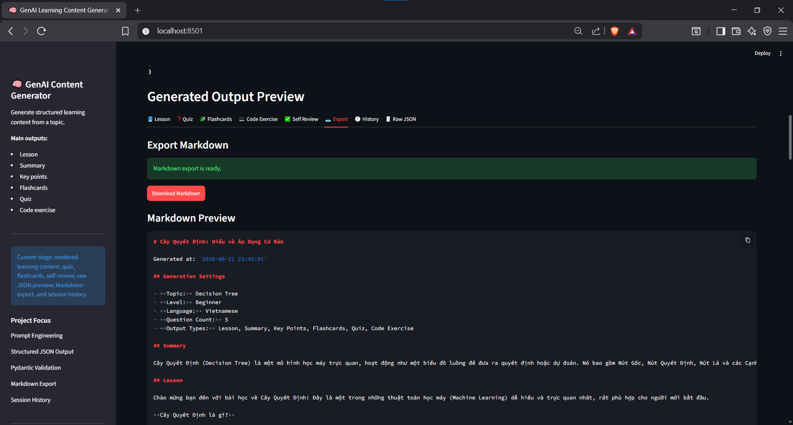
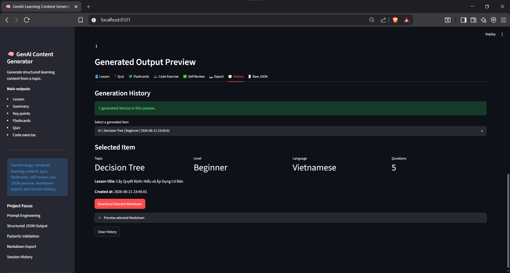
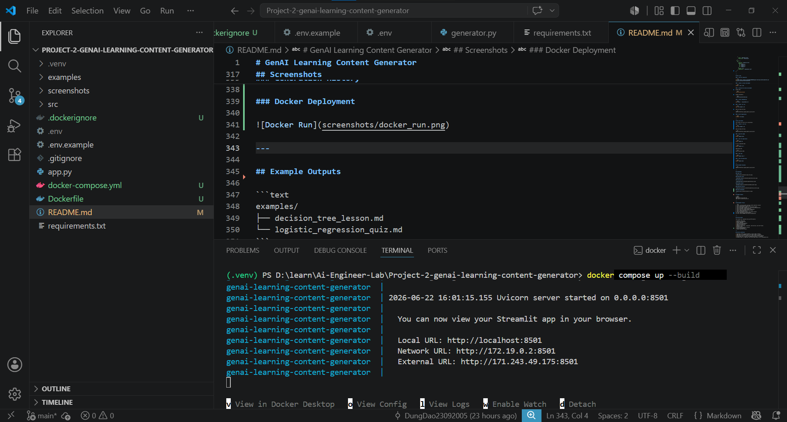

# GenAI Learning Content Generator

GenAI Learning Content Generator is a personal AI project that generates structured learning materials from a given topic using Generative AI.

Users can enter a topic, select a difficulty level, choose the number of quiz questions, select an output language, and generate learning content such as lesson notes, summaries, key points, flashcards, quizzes, answers, explanations, Python coding exercises, AI self-review, and Markdown exports.

This project was built as a portfolio project for AI Engineer / Machine Learning Engineer internship applications.

---

## Demo Features

* Enter a learning topic
* Select difficulty level: Beginner, Intermediate, Advanced
* Select number of quiz questions
* Select output language: Vietnamese or English
* Generate lesson content
* Generate summaries and key points
* Generate flashcards
* Generate multiple-choice quizzes
* Generate answers and explanations
* Generate small Python coding exercises
* Generate AI self-review for content quality
* Validate structured JSON output using Pydantic
* Parse and repair JSON output when needed
* Render validated content in Streamlit tabs
* Export generated content as Markdown
* Store generation history in the current app session

---

## Tech Stack

* Python
* Streamlit
* Gemini API
* Pydantic
* JSON parsing
* Markdown export
* python-dotenv
* Docker
* Docker Compose

---

## Project Architecture

```text
User enters topic and settings
        ↓
Validate user input with Pydantic
        ↓
Build prompt using prompt templates
        ↓
Send prompt to Gemini API
        ↓
Receive structured JSON output
        ↓
Clean and parse JSON response
        ↓
Validate output using Pydantic schema
        ↓
Render lesson, quiz, flashcards, code exercise, and self-review
        ↓
Export result as Markdown
        ↓
Save generated item to session history
```

---

## Folder Structure

```text
genai-learning-content-generator/
│
├── app.py
├── requirements.txt
├── README.md
├── Dockerfile
├── docker-compose.yml
├── .dockerignore
├── .env.example
├── .gitignore
│
├── src/
│   ├── __init__.py
│   ├── prompt_templates.py
│   ├── generator.py
│   ├── output_parser.py
│   ├── export_utils.py
│   └── schemas.py
│
├── examples/
│   ├── decision_tree_lesson.md
│   └── logistic_regression_quiz.md
│
└── screenshots/
    ├── input_form.png
    ├── generated_lesson.png
    ├── generated_quiz.png
    ├── markdown_export.png
    ├── generation_history.png
    └── docker_run.png
```

---

## Core Modules

### `prompt_templates.py`

Contains prompt templates for generating structured educational content, repairing invalid JSON, and reviewing content quality.

### `generator.py`

Handles communication with the Gemini API and uses fallback models for more reliable generation.

### `output_parser.py`

Cleans raw model output, extracts JSON, parses it, validates it with Pydantic, and attempts repair when the output is invalid.

### `schemas.py`

Defines Pydantic models for validating generation requests, lesson content, flashcards, quiz questions, code exercises, and AI self-review.

### `export_utils.py`

Converts validated learning content into a Markdown file that users can download.

### `app.py`

Main Streamlit application that connects the UI with the generation, validation, rendering, export, and history pipeline.

---

## Prompt Engineering Techniques

This project demonstrates several prompt engineering techniques:

* Role prompting
* Structured JSON output
* Difficulty control
* Language control
* Self-checking prompt
* JSON repair prompt
* Clear task decomposition
* Consistent output formatting
* Output validation with Pydantic

---

## Example Input

```text
Topic: Logistic Regression
Difficulty Level: Beginner
Number of Questions: 5
Language: Vietnamese
Output Type: Lesson + Quiz + Flashcards + Code Exercise
```

---

## Example Output Structure

```json
{
  "lesson_title": "Lesson title",
  "lesson": "Full lesson content",
  "summary": "Short summary",
  "key_points": [
    "Key point 1",
    "Key point 2"
  ],
  "flashcards": [
    {
      "term": "Important term",
      "definition": "Definition"
    }
  ],
  "quiz": [
    {
      "question": "Question text",
      "options": {
        "A": "Option A",
        "B": "Option B",
        "C": "Option C",
        "D": "Option D"
      },
      "answer": "B",
      "explanation": "Explanation text"
    }
  ]
}
```

---

## How to Run

### 1. Clone the repository

```bash
git clone https://github.com/DungDao23092005/genai-learning-content-generator.git
cd genai-learning-content-generator
```

### 2. Create a virtual environment

```bash
python -m venv .venv
```

### 3. Activate the virtual environment

Windows CMD:

```bash
.venv\Scripts\activate
```

Windows PowerShell:

```bash
.\.venv\Scripts\Activate.ps1
```

### 4. Install dependencies

```bash
pip install -r requirements.txt
```

### 5. Create .env file

```bash
copy .env.example .env
```

Add your Gemini API key:

```env
GOOGLE_API_KEY=your_google_gemini_api_key_here
```

### 6. Run the application

```bash
streamlit run app.py
```

---

## Run with Docker

This project can also be run using Docker.

### 1. Create a .env file

```bash
copy .env.example .env
```

Add your Gemini API key:

```env
GOOGLE_API_KEY=your_google_gemini_api_key_here
```

### 2. Build the image

```bash
docker compose build
```

### 3. Start the application

```bash
docker compose up
```

Or run in detached mode:

```bash
docker compose up -d
```

Application URL:

```text
http://localhost:8501
```

### 4. View logs

```bash
docker compose logs -f
```

### 5. Stop the application

```bash
docker compose down
```

---

## Environment Variables

```env
GOOGLE_API_KEY=your_google_gemini_api_key_here
```

---

## Screenshots

### Input Form



### Generated Lesson



### Generated Quiz



### Markdown Export



### Generation History



### Docker Deployment



---

## Example Outputs

```text
examples/
├── decision_tree_lesson.md
└── logistic_regression_quiz.md
```

---

## Development Process

```text
1. chore: initialize GenAI learning content generator project
2. feat: build Streamlit input form
3. feat: add Pydantic schemas for structured content
4. feat: add prompt templates for structured JSON generation
5. feat: add Gemini content generator
6. feat: parse and validate Gemini JSON output
7. feat: render validated learning content
8. feat: add Markdown export
9. feat: add generation history and example outputs
10. feat: add Docker containerization
11. docs: polish README and project documentation
```

---

## Current Status

This project has completed the main MVP features:

* Streamlit input form
* Gemini API integration
* Prompt templates
* Structured JSON generation
* JSON parsing and repair
* Pydantic validation
* Rendered lesson, quiz, flashcards, code exercise, and self-review
* Markdown export
* Session-based generation history
* Dockerized deployment
* Example generated outputs

---

## Current Limitations

* Generated content quality depends on the AI model response.
* JSON repair is attempted once if the model output is invalid.
* Generation history is stored only in the current Streamlit session.
* The app does not currently store generated content in a database.
* Markdown export is supported, but PDF and DOCX export are not implemented yet.

---

## Future Improvements

* Add FastAPI backend
* Add PDF export
* Add DOCX export
* Add downloadable flashcard deck
* Add quiz difficulty analysis
* Add persistent database storage
* Add user authentication
* Support additional LLM providers
* Deploy to Azure, AWS, GCP, or Hugging Face Spaces

---

## What I Learned

Through this project, I practiced:

* Prompt engineering
* Structured JSON generation
* Gemini API integration
* Pydantic schema validation
* JSON parsing and repair
* Streamlit UI development
* Markdown export
* Session state management
* Docker containerization
* Docker Compose environment management
* Git workflow with meaningful commits

---

## Author

**Dung Dao**

* GitHub: https://github.com/DungDao23092005

---

## License

This project is intended for educational and portfolio purposes.
